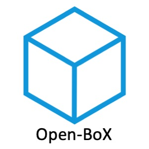

------------------

## Open-BOX: an efficient Blackbox Optimization (BO) Library.
Lite-BO is an efficient and effective blackbox optimization toolkit, which owns the following characteristics:
1. Blackbox solvers.
2. BO with transfer learning.
3. BO with constraints.
4. BO with parallel support.
5. BO with multi-fidelity evaluations.
6. BO with multi-objective.
