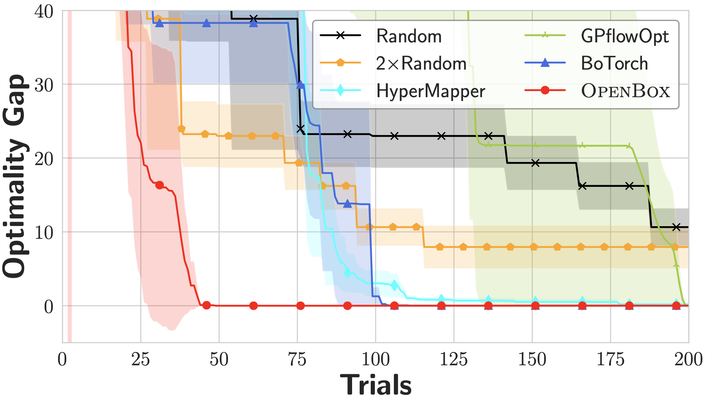
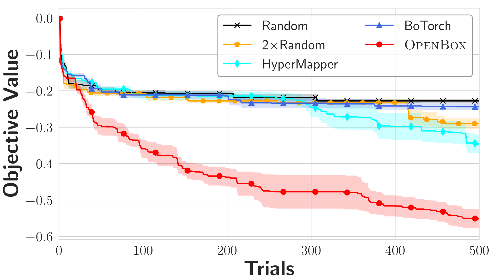
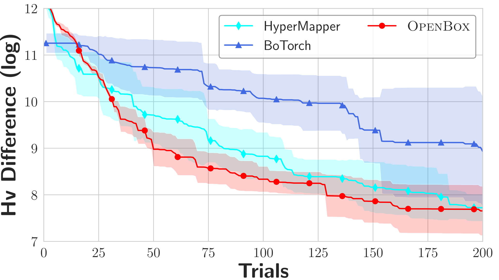
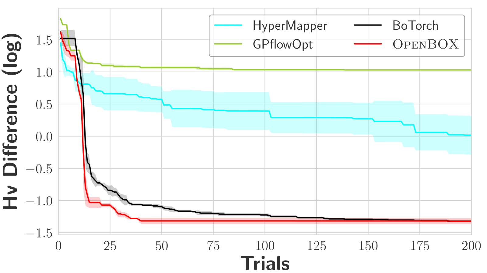
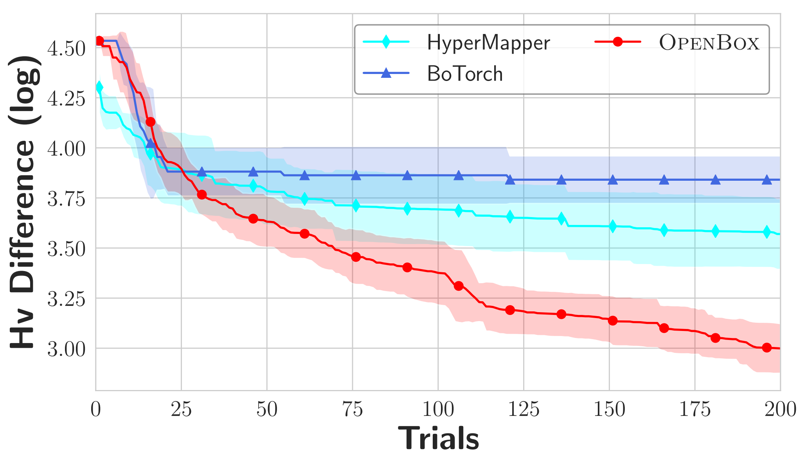

[](https://github.com/thomas-young-2013/automl-toolkit/blob/master/LICENSE)

---

## Open-BOX: an efficient Blackbox Optimization (BO) Library.
Open-BOX is an efficient and effective blackbox optimization toolkit, which owns the following characteristics:
1. Black-box solvers.
2. BO with transfer learning.
3. BO with constraints.
4. BO with parallel support.
5. BO with multi-fidelity evaluations.
6. BO with multi-objective.

# Features

+ Ease of use. Minimal user configuration and setup, and necessary visualization for optimization process. 
+ Performance standards. Host state-of-the-art optimization algorithms; select proper algorithms automatically.
+ Cost-oriented management. Give cost-model based suggestions to users, e.g., minimal machines or time-budget. 
+ Scalability. Scale to dimensions on the number of input variables, objectives, tasks, trials, and parallel evaluations.
+ High efficiency. Effective use of parallel resource, speeding up optimization with transfer-learning, and multi-fidelity acceleration for computationally-expensive evaluations. 
+ Data privacy protection, robustness and extensibility.

# Benchmarks

Single-objective problems
Ackley-4                  | Hartmann
:-------------------------:|:-------------------------:
  |  

Single-objective problems with constraints
Mishra                  | Keane-10
:-------------------------:|:-------------------------:
  |  

Multi-objective problems

DTLZ1-6-5             | ZDT2-3 
:-------------------------:|:-------------------------:
  |  

Multi-objective problems with constraints

CONSTR             | SRN 
:-------------------------:|:-------------------------:
  |  

# Installation

**Installation via pip**

For Windows and Linux users, you can install by

```bash
pip install lite-bo
```

For macOS users, you need to install `pyrfr` correctly first, and then `pip install lite-bo`. 

The tips for installing `pyrfr` on macOS is [here](docs/install/install-pyrfr-on-macos.md).

**Manual installation from the github source**

 ```bash
git clone https://github.com/thomas-young-2013/lite-bo.git && cd lite-bo
cat requirements.txt | xargs -n 1 -L 1 pip install
python setup.py install
 ```
macOS users still need to follow the [tips](docs/install/install-pyrfr-on-macos.md) to install `pyrfr` correctly first.

# Quick Start

```python
import numpy as np
from litebo.utils.start_smbo import create_smbo


def branin(x):
    xs = x.get_dictionary()
    x1 = xs['x1']
    x2 = xs['x2']
    a = 1.
    b = 5.1 / (4. * np.pi ** 2)
    c = 5. / np.pi
    r = 6.
    s = 10.
    t = 1. / (8. * np.pi)
    ret = a * (x2 - b * x1 ** 2 + c * x1 - r) ** 2 + s * (1 - t) * np.cos(x1) + s
    return {'objs': (ret,)}


config_dict = {
    "optimizer": "SMBO",
    "parameters": {
        "x1": {
            "type": "float",
            "bound": [-5, 10],
            "default": 0
        },
        "x2": {
            "type": "float",
            "bound": [0, 15]
        },
    },
    "advisor_type": 'default',
    "max_runs": 90,
    "time_limit_per_trial": 5,
    "logging_dir": 'logs',
    "task_id": 'hp1'
}

bo = create_smbo(branin, **config_dict)
bo.run()
inc_value = bo.get_incumbent()
print('BO', '=' * 30)
print(inc_value)
```

# Reference
1. Frank Hutter, Holger H Hoos, and Kevin Leyton-Brown. 2011. Sequential model-based optimization for general algorithm configuration. In International Conference on Learning and Intelligent Optimization. Springer, 507–523.
2. Nicolas Knudde, Joachim van der Herten, Tom Dhaene, and Ivo Couckuyt. 2017. GPflowOpt: A Bayesian Optimization Library using TensorFlow. arXiv:1711.03845.
3. Luigi Nardi, David Koeplinger, and Kunle Olukotun. 2019. Practical Design Space Exploration. arXiv:1810.05236.
4. Maximilian Balandat, Brian Karrer, Daniel R.Jiang, Samuel Daulton, Benjamin Letham, Andrew Gordon Wilson, and Eytan Bakshy. 2020. BoTorch: A Framework for Efficient Monte-Carlo Bayesian Optimization. In Advances in Neural Information Processing Systems.
