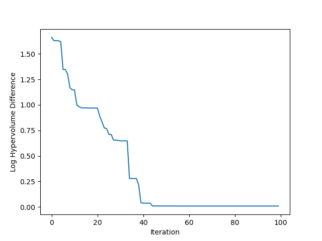

# Multi-Objective with Constraint

In this tutorial, we illustrate how to optimize constrained multiple objectives problem with **Open-Box**.

## Problem Setup

We use constrained multi-objective problem CONSTR in this example.

```python
from litebo.benchmark.objective_functions.synthetic import CONSTR

prob = CONSTR()
dim = 2
initial_runs = 2 * (dim + 1)
```

Mention that the objective function should return a <font color=#FF0000>**dict**.</font>
The result dict should contain:

+ **'objs'**: A **list/tuple** of **objective values (to be minimized)**. 
In this example, we have one objective so return a tuple contains a single value.

+ **'constraints**': A **list/tuple** of **constraint values**.
Constraints less than zero (**"<=0"**) implies feasibility.

## Run Optimization

```python
from litebo.optimizer.generic_smbo import SMBO
bo = SMBO(prob.evaluate,
          prob.config_space,
          num_objs=prob.num_objs,
          num_constraints=prob.num_constraints,
          max_runs=100,
          surrogate_type='gp',
          acq_type='ehvic',
          acq_optimizer_type='random_scipy',
          initial_runs=initial_runs,
          init_strategy='sobol',
          ref_point=prob.ref_point,
          task_id='moc',
          random_state=1)
bo.run()
```

Here we create a <font color=#FF0000>**SMBO**</font> object, passing the objective function and the 
configuration space to it. 

+ **num_objs** and **num_constraints** sets how many objectives and constraints the objective function will return.

+ **max_runs=100** means the optimization will take 100 rounds (100 times of objective function evaluation). 

+ **surrogate_type='gp'**. For mathematical problem, we suggest using Gaussian Process (**'gp'**) as Bayesian surrogate
model. For practical problems such as hyperparameter optimization (HPO), we suggest using Random Forest (**'prf'**).

+ **acq_type='ehvic'**. Use **EHVIC(Expected Hypervolume Improvement with Constraint)**
as Bayesian acquisition function.

+ **acq_optimizer_type='random_scipy'**. For mathematical problem, we suggest using **'random_scipy'** as
acquisition function optimizer. For practical problems such as hyperparameter optimization (HPO), we suggest
using **'local_random'**.

+ **initial_runs** sets how many configurations are suggested by **init_strategy** before the optimization loop.

+ **init_strategy='sobol'** sets the strategy to suggest the initial configurations.

+ **ref_point** sets the reference point of the problem used to calculate the hypervolume. If using EHVIC method,
a ref_point must be provided.

+ **task_id** is set to identify the optimization process.

Then, call <font color=#FF0000>**bo.run()**</font> to start the optimization process and wait for the result to return.

For detailed usage of **SMBO**, please see our [Manual](../manual/manual)

## Observe Optimization Results

Since we optimize every objective at the same time, we will get a pareto front as results.
Call <font color=#FF0000>**bo.get_history().get_pareto_front()**</font> to get the pareto front.

```python
import numpy as np
import matplotlib.pyplot as plt
# plot pareto front
pareto_front = np.asarray(bo.get_history().get_pareto_front())
if pareto_front.shape[-1] in (2, 3):
    if pareto_front.shape[-1] == 2:
        plt.scatter(pareto_front[:, 0], pareto_front[:, 1])
        plt.xlabel('Objective 1')
        plt.ylabel('Objective 2')
    elif pareto_front.shape[-1] == 3:
        ax = plt.axes(projection='3d')
        ax.scatter3D(pareto_front[:, 0], pareto_front[:, 1], pareto_front[:, 2])
        ax.set_xlabel('Objective 1')
        ax.set_ylabel('Objective 2')
        ax.set_zlabel('Objective 3')
    plt.title('Pareto Front')
    plt.show()
```


Then plot the hypervolume difference during the optimization compared to the ideal pareto front.

```python
# plot hypervolume
hypervolume = bo.get_history().hv_data
max_hv = 92.02004226679216
log_hv_diff = np.log10(max_hv - np.asarray(hypervolume))
plt.plot(log_hv_diff)
plt.xlabel('Iteration')
plt.ylabel('Log Hypervolume Difference')
plt.show()
```



