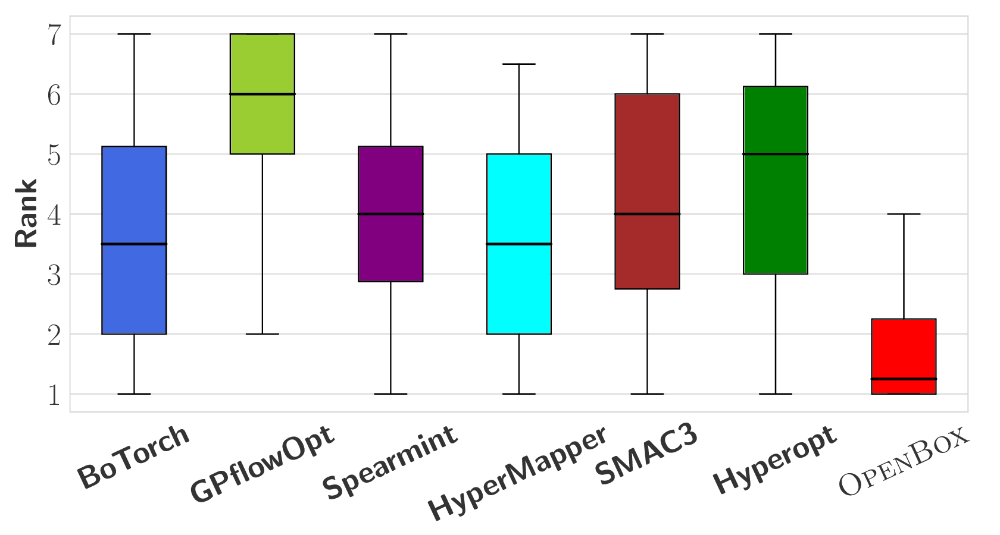

########
Overview
########

OpenBox: 高效通用的黑盒优化系统
===========================

**OpenBox** is an efficient and generalized blackbox optimization (BBO) system,
which owns the following characteristics:

1. Basic BBO algorithms.

2. BBO with constraints.

3. BBO with multiple objectives.

4. BBO with transfer learning.

5. BBO with distributed parallelization.

6. BBO with multi-fidelity acceleration.

7. BBO with early stops.

Deployment Artifacts
--------------------

Standalone Python package
^^^^^^^^^^^^^^^^^^^^^^^^^

You can install the released package and use it using Python.

Distributed BBO service
^^^^^^^^^^^^^^^^^^^^^^^

We adopt the "BBO as a service" paradigm and implement OpenBox as a managed general service for black-box optimization.
Users can access this service via REST API conveniently, and do not need to worry about other issues such as
environment setup, software maintenance, programming, and optimization of the execution. Moreover, we also provide a
Web UI, through which users can easily track and manage the tasks.

Design Goal
-----------

OpenBox’s design satisfies the following desiderata:

+ **Ease of use**. Minimal user effort, and user-friendly visualization
  for tracking and managing BBO tasks.

+ **Consistent performance**. Host state-of-the-art optimization
  algorithms; choose the proper algorithm automatically.

+ **Resource-aware management**. Give cost-model based advice
  to users, e.g., minimal workers or time-budget.

+ **Scalability**. Scale to dimensions on the number of input variables,
  objectives, tasks, trials, and parallel evaluations.

+ **High efficiency**. Effective use of parallel resources, system
  optimization with transfer-learning and multi-fidelities, etc.

+ **Fault tolerance**, **extensibility**, and **data privacy protection**.

Use Case
--------

The goal of black-box optimization is to find a configuration that
approaches the global optimum as rapidly as possible since evaluation of objective functions is often expensive.

Traditional BBO with a single objective has many applications:

1) automatic A/B testing.

2) experimental design.

3) knobs tuning in database.

4) automatic hyper-parameter tuning, one of the most indispensable components in AutoML systems,
   where the task is to minimize the validation error of a machine learning algorithm as a function of its
   hyper-parameters.

Recently, generalized BBO emerges and has been applied to many areas:

1) processor architecture and circuit design.

2) resource allocation.

3) automatic chemical design.

Generalized BBO requires more general functionalities that may not be supported by traditional BBO,
such as multiple objectives and constraints.

Functionality Scope
-------------------

OpenBox has a wide range of functionality scope:

+ **Black–box optimization (BBO)**: Optimizing the objective function that has no analytical form or information
  such as the derivative of the objective function.

+ **FIOC**: Support all Float, Integer, Ordinal and Categorical variables.

+ **Multi-obj.**: Support optimizing multiple objectives.

+ **Constraint**: Support for inequality constraints.

+ **History**: Support injecting the prior knowledge from previous tasks in the search.

+ **Distributed**: Supports parallel evaluations under a distributed environment.

.. image:: ./../assets/functionality_scope.jpg

+ A taxonomy of black-box optimization (BBO) systems/softwares.
  △ means the system cannot support it for many cases.

Performance Rank
----------------

Performance rank of AutoML Benchmark on LightGBM on 25 datasets. The lower is the
better.
